# Block-Level Verification of VSDSquadron SoC

## Caravel Block Results

### user_pass_thru - Passed

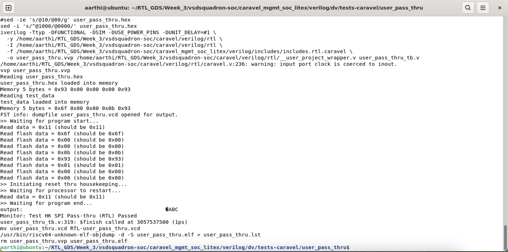

### uart - Passed

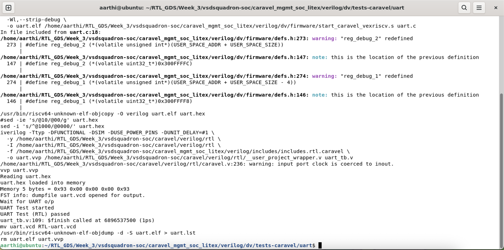

### sysctrl - Failed

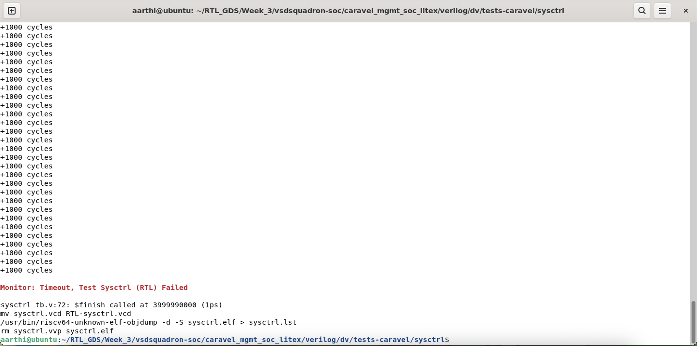

### sram_exec - Passed

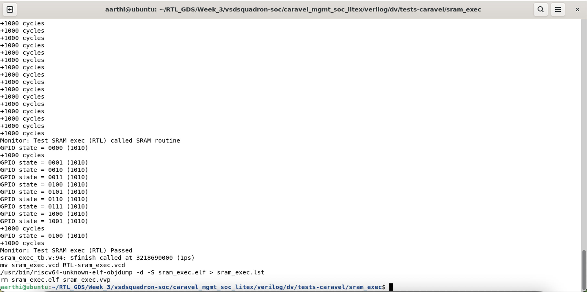

### spi_master - Passed

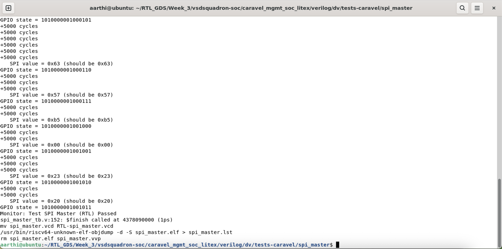

### pullupdown - Passed

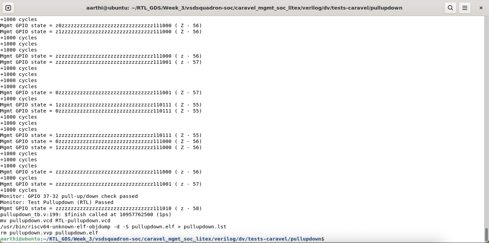

### pll - Failed

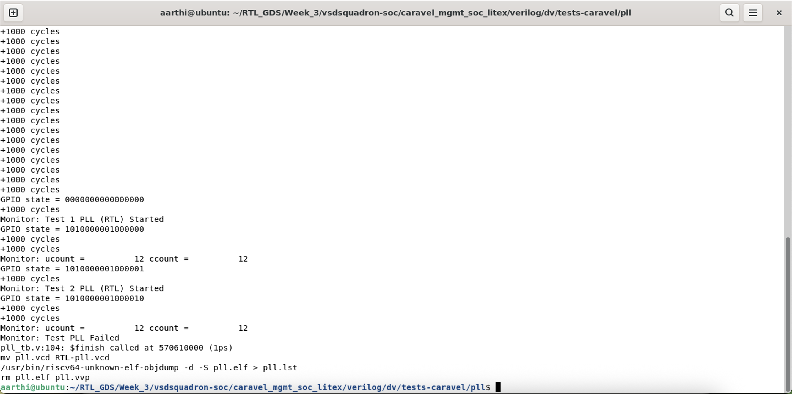

### pass_thru_fix - Passed

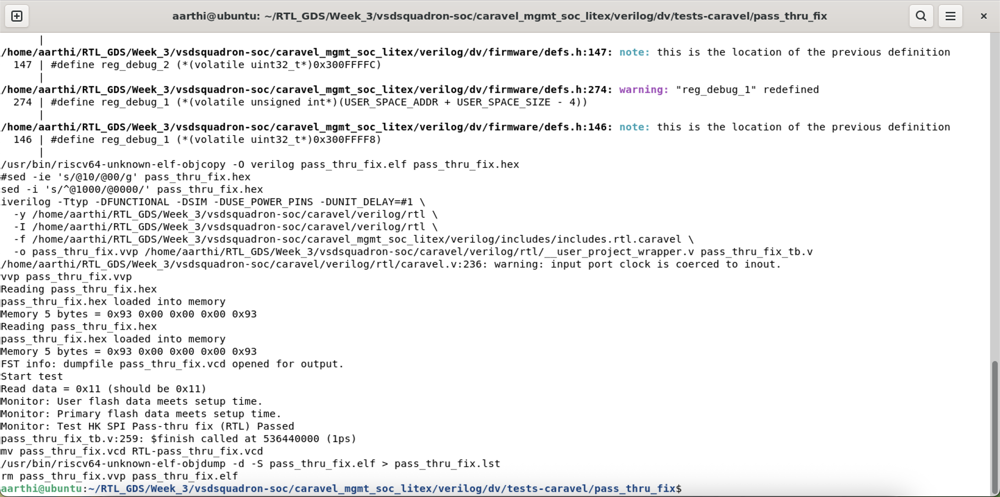

### mem - Passed

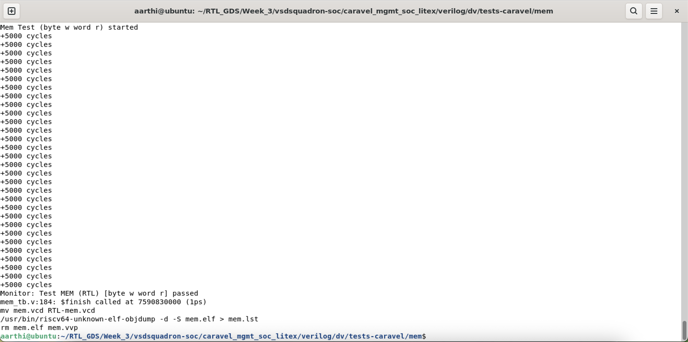

### hkspi_power - Passed

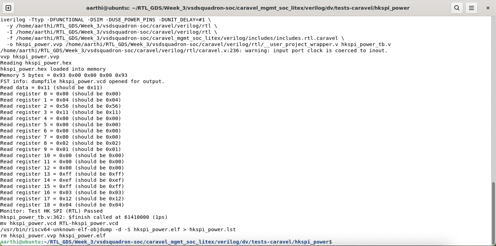

### gpio_mgmt - Passed

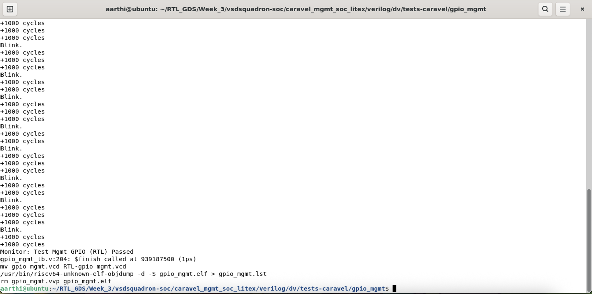

### hkspi - Passed

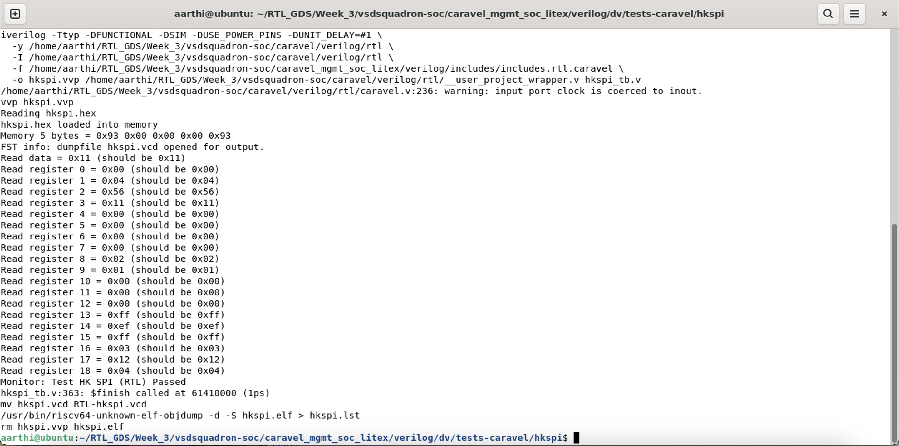

### Caravel Test Result Table 

| tests-caravel | status |
| -------- | -------- |
| user_pass_thru | PASS |
| uart	| PASS |
| sysctrl | FAIL |
| sram_exec	| PASS |
| spi_master	| PASS |
| pullupdown	| PASS |
| pll	| FAIL |
| pass_thru_fix	| PASS |
| mem	| PASS |
| hkspi_power	| PASS |
| gpio_mgmt	| PASS	| 
| hkspi	| PASS |