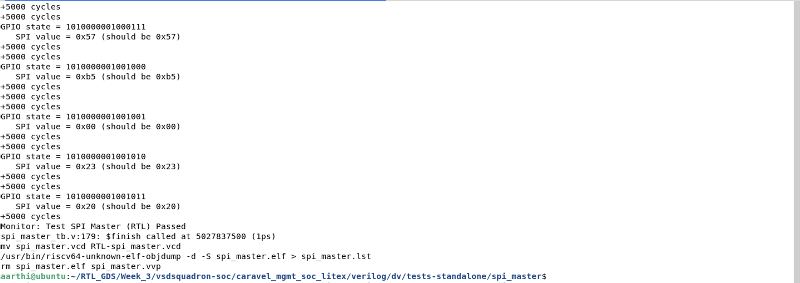
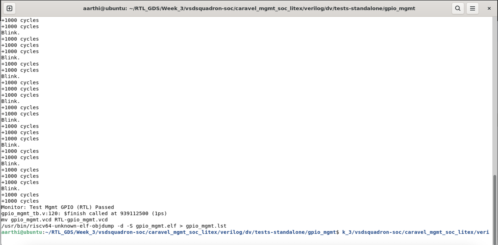
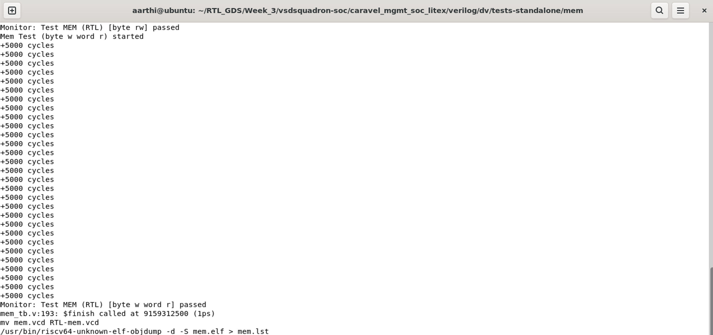
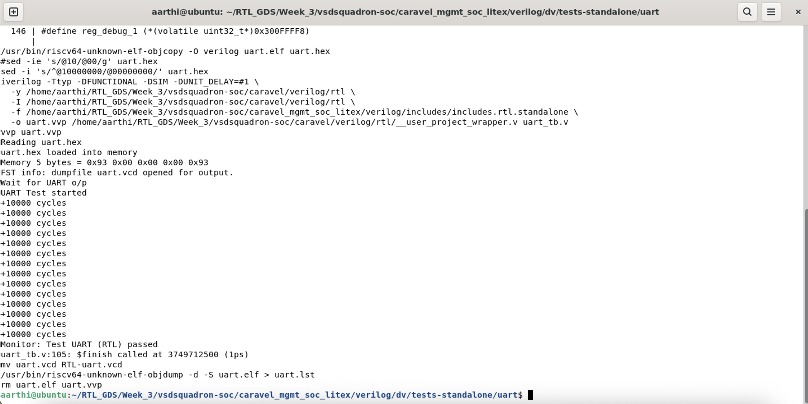
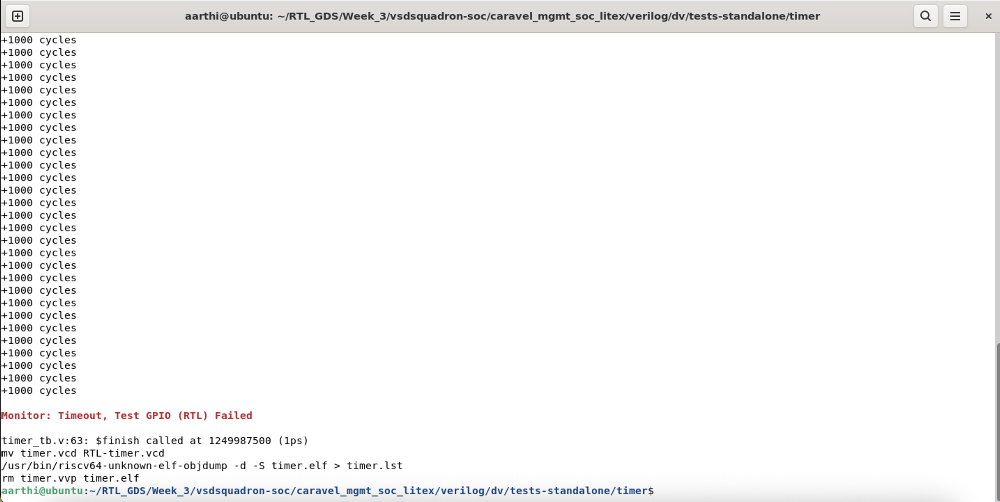
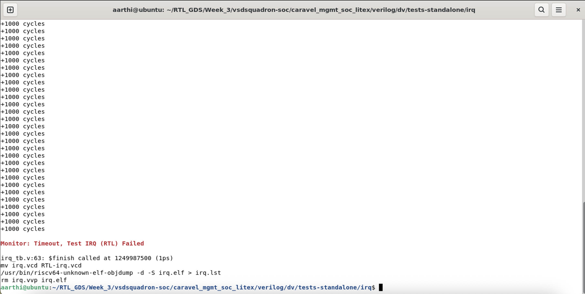
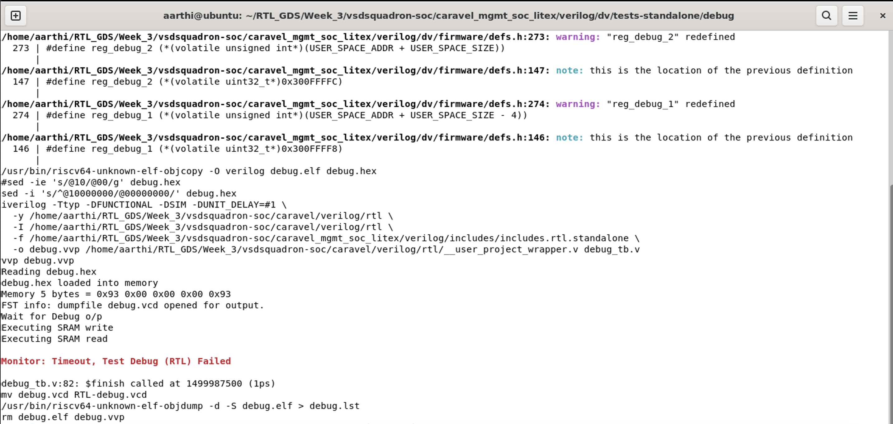

# Block-Level Verification of VSDSquadron SoC

## Standalone Block Results

### spi_master - Passed

### gpio_mgmt - Passed

### mem - Passed

### uart - Passed

### timer - Failed

### irq - Failed

### debug - Failed

### Standalone Test Result Table 

| tests-standalone | status(sky130) |
| -------- | -------- |
| gpio_mgmt	| PASS	| 
| mem	| PASS |
| uart	| PASS |
| timer	| FAIL |
| irq	| FAIL |
| debug	| FAIL |
| spi_master	| PASS |
