# Gate-Level Simulation (GLS) for Full Block Verification

## PHASE 1 — Prepare Gate-Level Netlist Integration

### Path to the netlist used:
- The full path of the netlist is **"RTL_GDS/Week_4/orfs/flow/results/sky130hd/user_project_wrapper/base/6_final.v"**
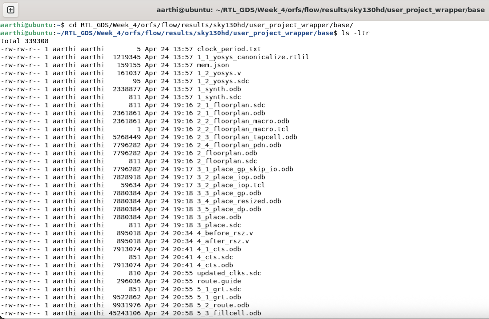
- The below image denotes the presence of "6_final.v" file under the results folder
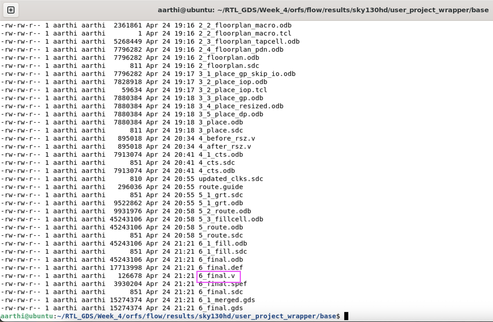

### About "6_final.v" netlist:
- The file **"6_final.v"** is the final netlist generated post simulation for the user_project_wrapper project in **Week-4**
- It is the comprehensive gate-level netlist generated at the conclusion of the GDSII flow
- It differs from the RTL by substituting abstract code with specific physical gate instantiations from the Sky130 standard cell library
- It acts as the  primary input for Gate-Level Simulation (GLS)
- Post final simulation the file is generated under the **results** folder

---
## PHASE 2 — Modify Verification Flow for GLS

The changes made in the makefile are depicted in the **"makefile_changes.md"** file

---
## PHASE 3 — Run GLS for Standalone Tests

Tests-Standalone block contains GPIO Mgmt, mem, uart, timer, irq, debug and spi_master tests.

These tests are executed by repeating the below steps for all the tests in the block

**Execution Steps:**

**Step 1:** Navigate to the test directory using the command `cd test_name`

**Step 2:** Do the changes in the Makefile

**Step 3:** Execute these commands sequentially
`make clean`
`make` 

**Step 4:** Observe the result

The execution results are available in the **"standalone_gls_results.md"** file

---
## PHASE 4 — Run GLS for Caravel Integrated Tests

Tests-Caravel block contains user_pass_thru, uart, sysctrl, sram_exec, spi_master, pullupdown, pll, pass_thru_fix, mem, hkspi_power, gpio_mgmt and hkspi tests.

These tests are executed by repeating the below steps for all the tests in the block

**Execution Steps:**

**Step 1:** Navigate to the test directory using the command `cd test_name`

**Step 2:** Do the changes in the Makefile

**Step 3:** Execute these commands sequentially
`make clean`
`make` 

**Step 4:** Observe the result

The execution results are available in the **"caravel_gls_results.md"** file

---
## PHASE 5 — GTKWave Visualization

Once the verification flow completes, a **".vcd"** file will be generated in the same location. To view the generated .vcd file in GTKWave, `gtkwave filename.vcd` command is used.
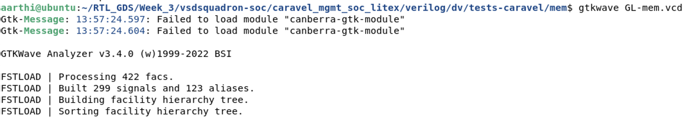

### Generated GTKWave:
- **Caravel Test - mem:**
    + The **"checkbits"** values need to be checked for this test
      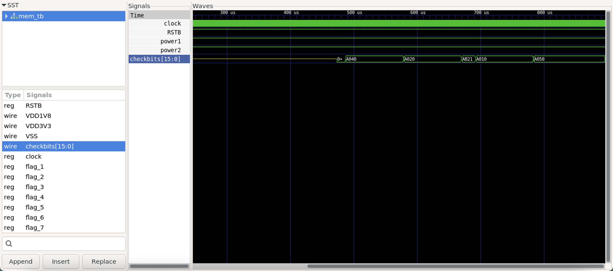 

- **Caravel Test - pass_thru_fix:**
    + According to this test, the register(**"tbdata"**)value should be equal to 11
      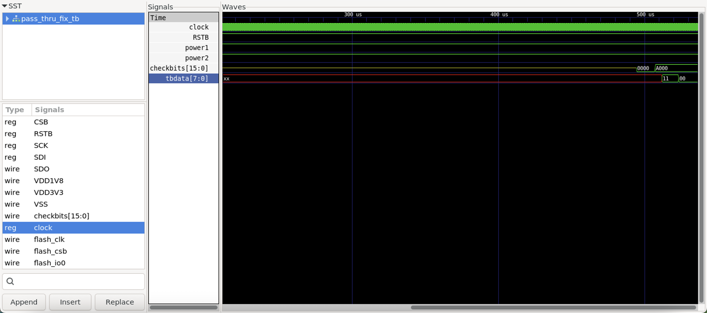

---
## PHASE 6 — RTL vs GLS Comparison

### Standalone test results:
- **RTL:**
    + Total number of tests = 7
    + Passed = 5
    + Failed = 2
- **GLS:**
    + Total number of tests = 7
    + Passed = 5
    + Failed = 2
- **Inference -** The standalone test results for both RTL and GLS are identical, confirming a successful match between the two verification flows

### Caravel test results:
- **RTL:**
    + Total number of tests = 12
    + Passed = 10
    + Failed = 2
- **GLS:**
    + Total number of tests = 12
    + Passed = 4
    + Failed = 8
- **Inference -** Out of the 12 total tests, only six yielded consistent results between the RTL and GLS flows, the remaining six tests passed during RTL but failed during the Gate-Level Simulation.

---
## PHASE 7 — Debugging 

### Issue - 1 
**Some of the modules missed while running the standalone tests**

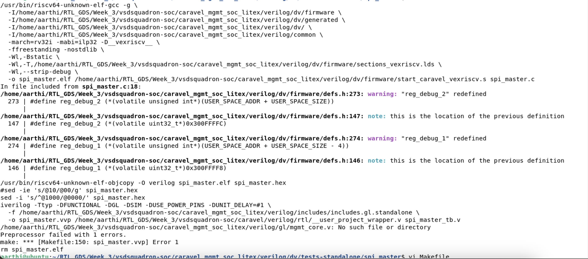
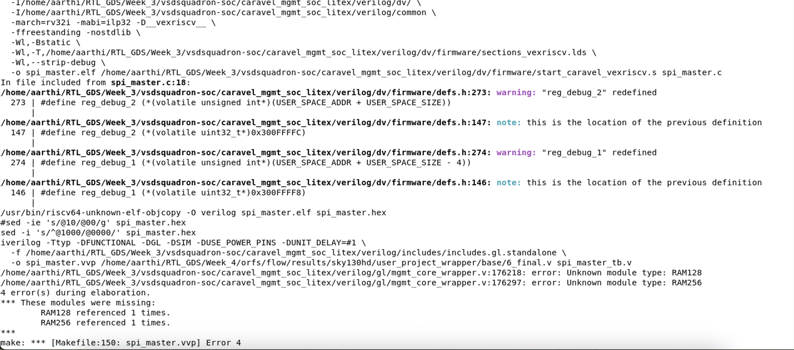
The missed modules are added in the **"includes.gl.standalone"** file
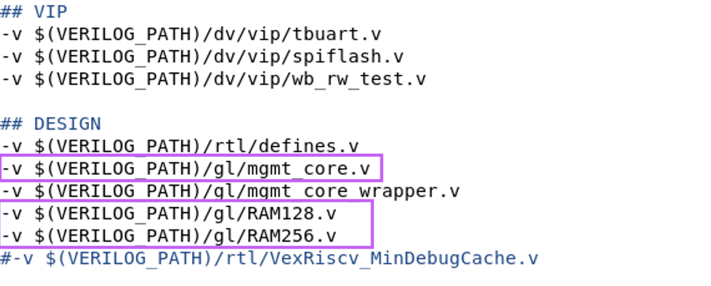

### Issue - 2 
**Some of the ports missed while running the caravel tests**  

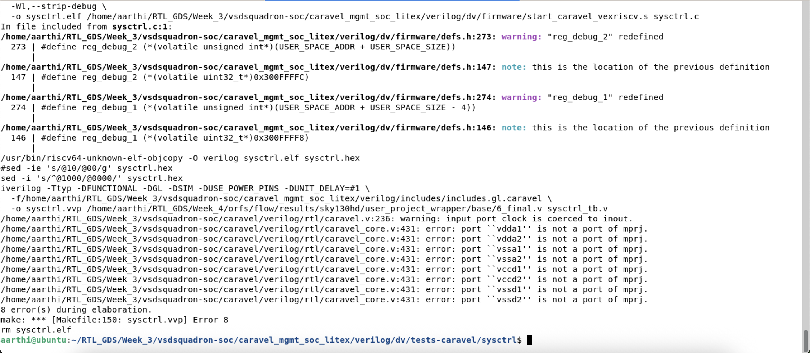
The missed ports are added in the **"6_final.v"** file
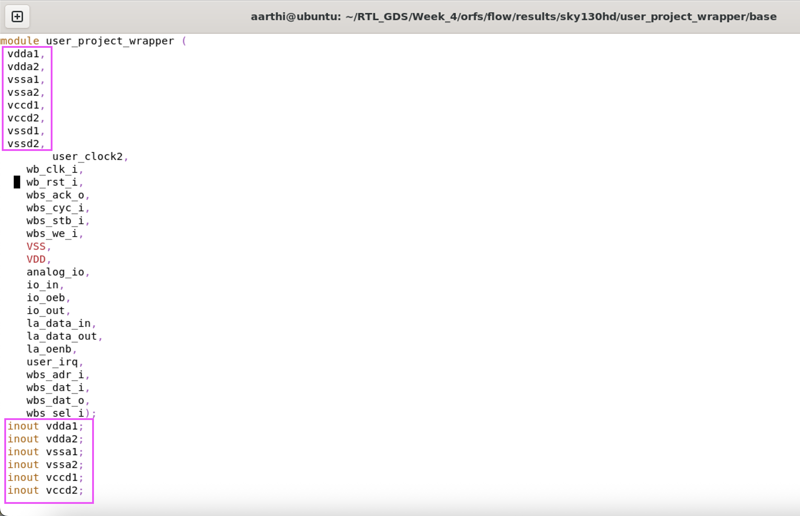

### Issue - 3 
**Mismatch in the results for caravel tests** 

- In GLS, user_pass_thru, uart, sram_exec, spi_master, pullupdown and gpio_mgmt caravel tests failed whereas  in RTL all the 6 test cases passed.
- uart, sram_exec, spi_master, pullupdown and gpio_mgmt tests explicitly thrown the failed message whereas user_pass_thru execution got stuck
- The below mentioned changes are made in the testbench file to overcome the failure:
    + The `clock` was initialized to **0** to prevent them from getting stuck to an undefined value
    + **Before change:**
    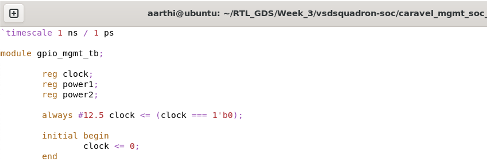
    + **After change:**
    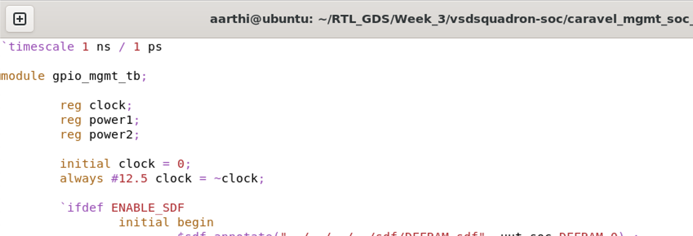
    + `force` command was added to force the physical power for GLS
    + **Before change:**
    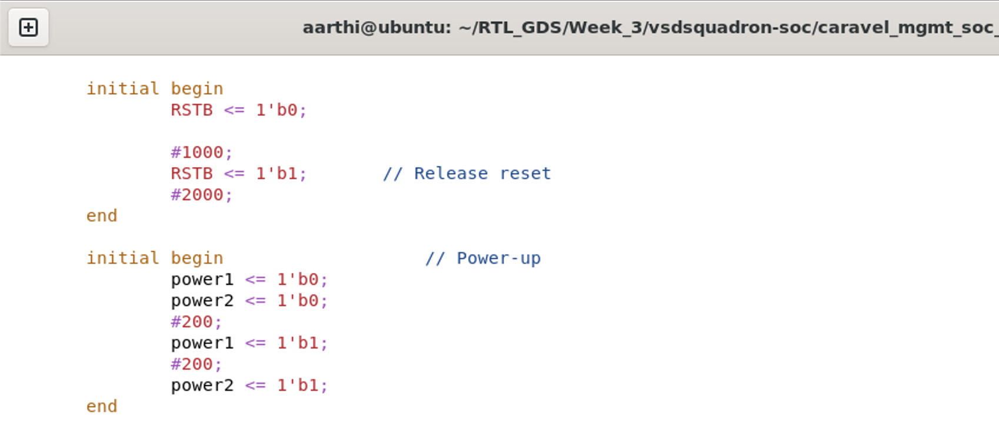
    + **After change:**
    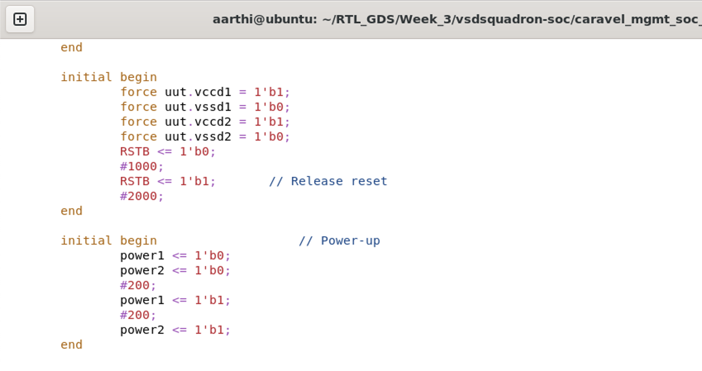    
    + The repeat cycles count was increased from 100 to 10000 as GLS is slower than RTL
    + **Before change:**
    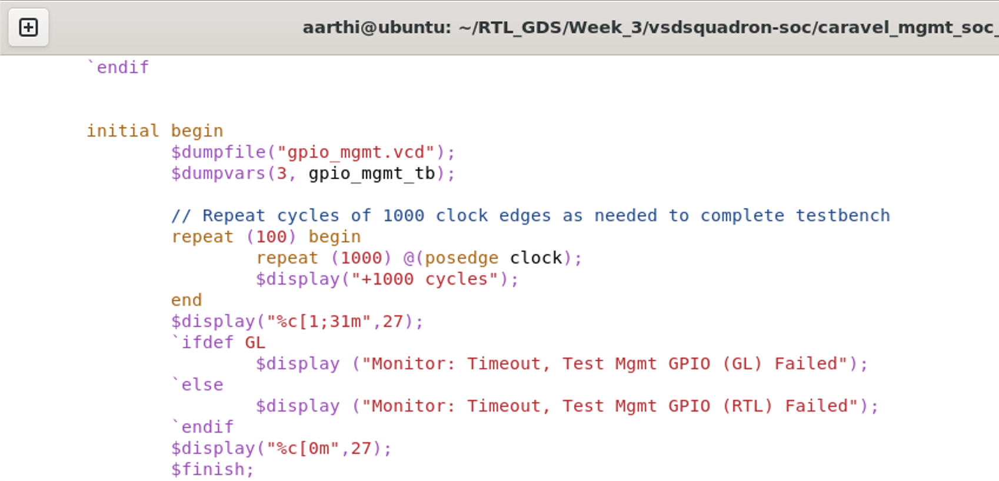
    + **After change:**
    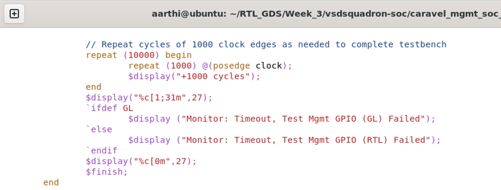    
- Despite implementing the intended fixes, the test cases continue to fail
---

