# Gate-Level Simulation (GLS) for Full Block Verification

## PHASE 4 — Run GLS for Caravel Integrated Tests

### Execution results:

#### 1️⃣ mem - Passed

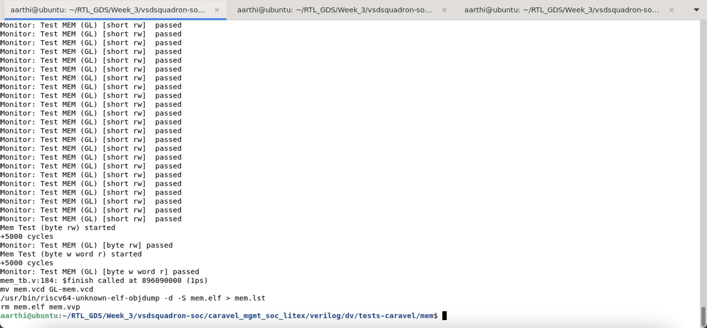

#### 2️⃣ pass_thru_fix - Passed

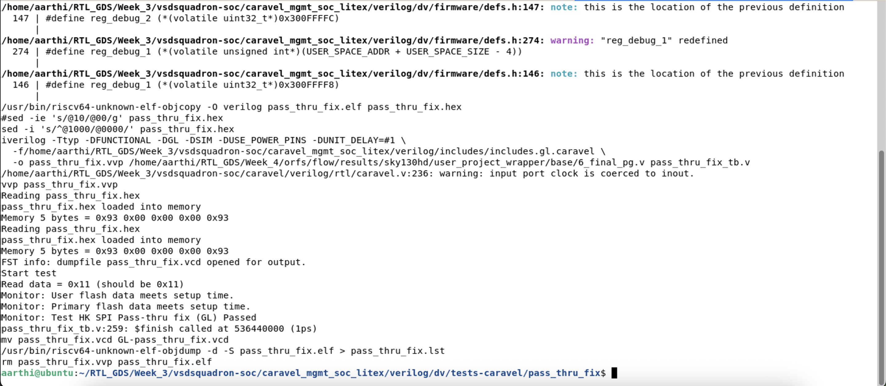

#### 3️⃣ hkspi_power - Passed

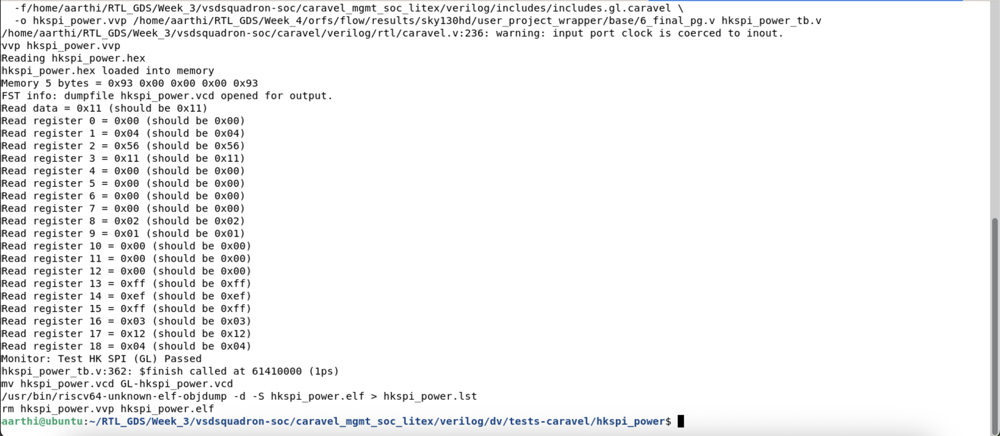

#### 4️⃣ hkspi - Passed

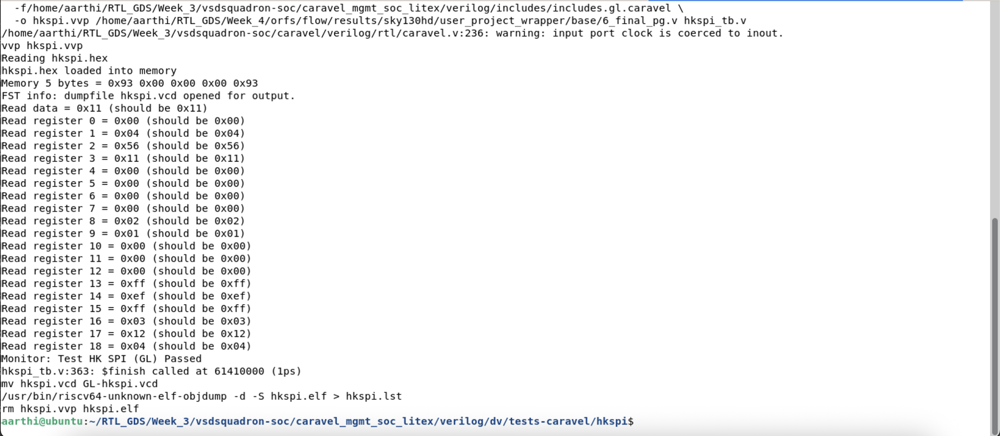

#### 5️⃣ sysctrl - Failed

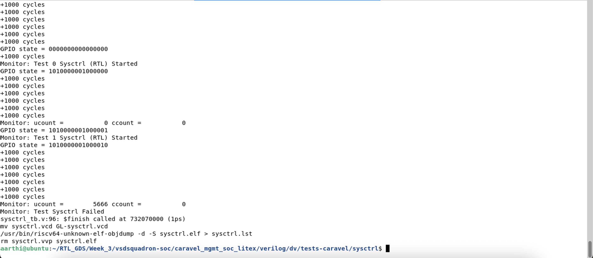

#### 6️⃣ pll - Failed

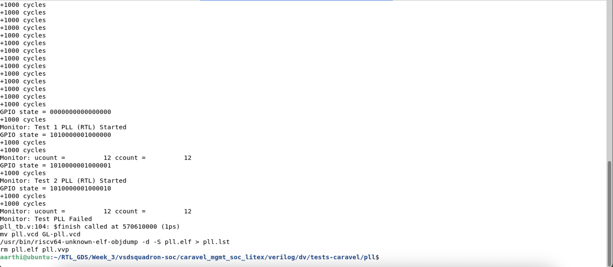

#### 7️⃣ pullupdown - Failed

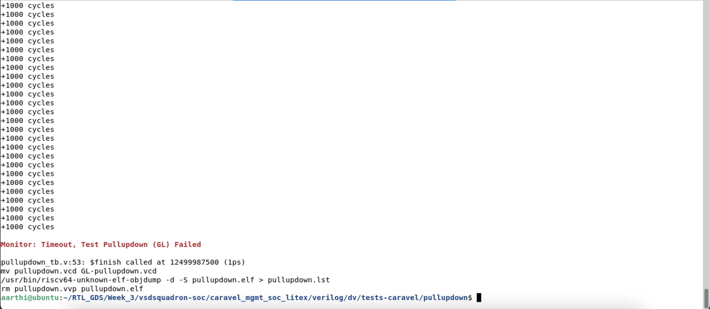

#### 8️⃣ uart - Failed

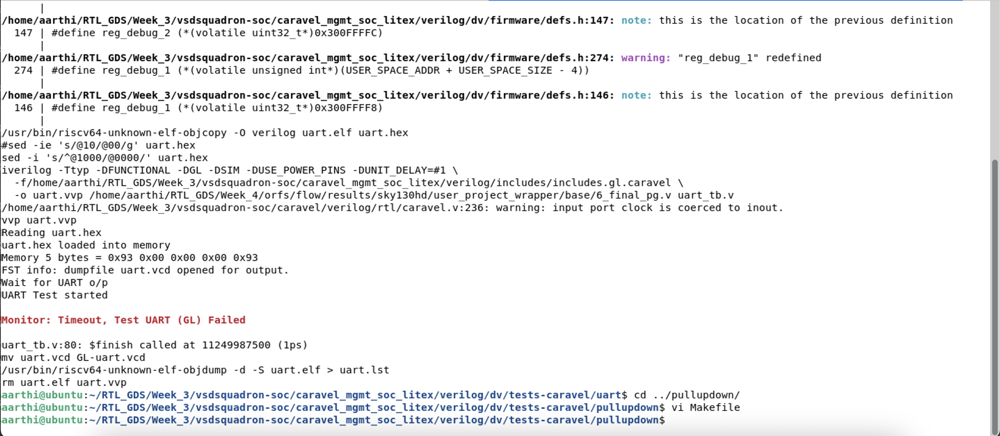

#### 9️⃣ sram_exec - Failed

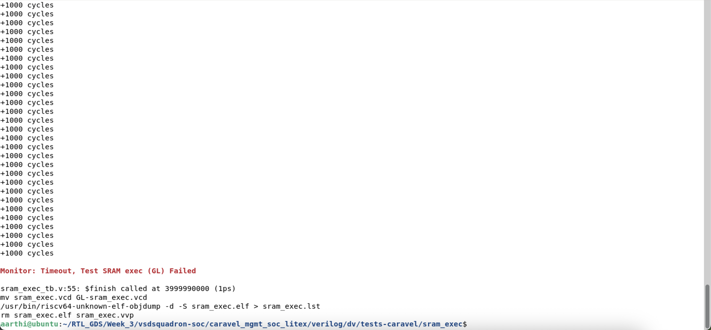

#### 🔟 spi_master - Failed

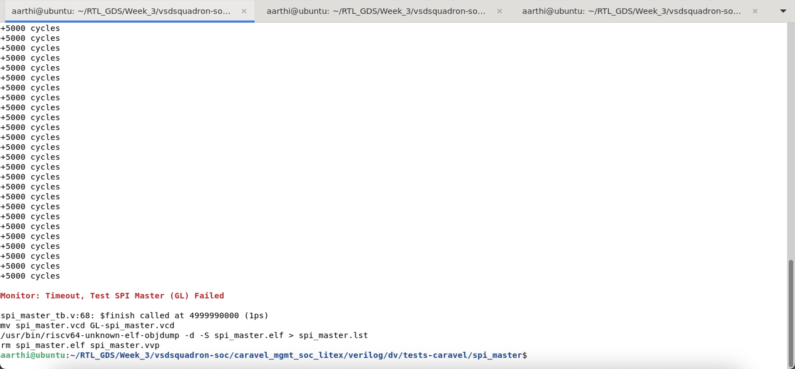

#### 1️⃣1️⃣ gpio_mgmt - Failed

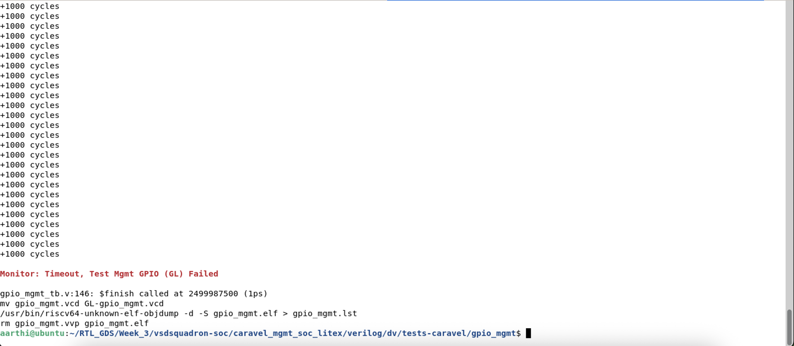

#### 1️⃣2️⃣ user_pass_thru - Execution got stuck

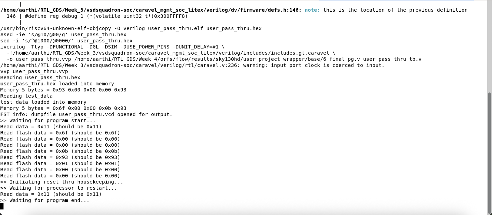

### Caravel GLS Result Table 

| Test | RTL Status(Week-3)| GLS Status|
| -------- | -------- | -------- |
| user_pass_thru | PASS | FAIL |
| uart	| PASS | FAIL |
| sysctrl | FAIL | FAIL |
| sram_exec	| PASS | FAIL |
| spi_master	| PASS | FAIL |
| pullupdown	| PASS | FAIL |
| pll	| FAIL | FAIL |
| pass_thru_fix	| PASS | PASS |
| mem	| PASS | PASS |
| hkspi_power	| PASS |PASS |
| gpio_mgmt	| PASS	| FAIL |
| hkspi	| PASS | PASS |

### Inference:
The Gate-Level Simulation (GLS) verification results demonstrate only a 50% correlation with the initial RTL verification outcomes.