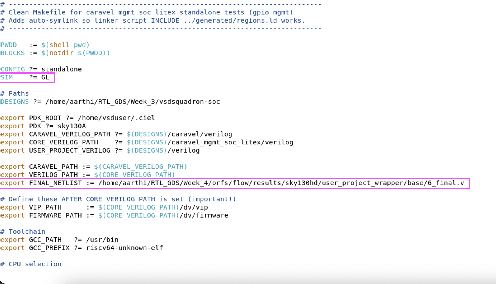
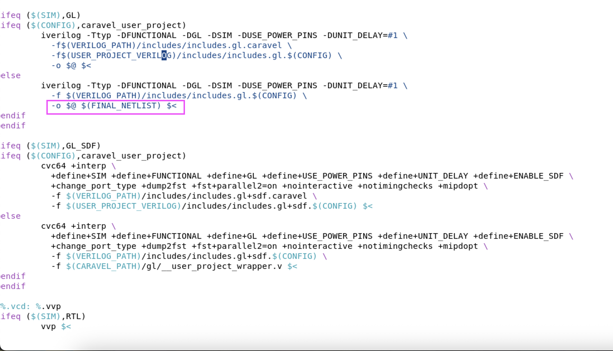
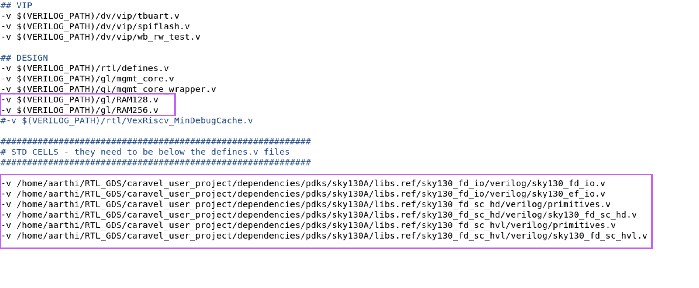

# Gate-Level Simulation (GLS) for Full Block Verification

## PHASE 2 — Modify Verification Flow for GLS

In order to proceed with the verification flow for GLS, some changes need to be made in the makefile which are listed below,
- The simulator need to be changed from RTL to GL. This is done by changing the value of **"SIM"** as **"GL"**
- The file path of the 6_final.v file is added to the variable named **"FINAL_NETLIST"** 
- **"-o $@ $(FINAL_NETLIST) $<"** was added to include the file in the verification flow
- The below images depict the changes made in the makefile

In addition to the final netlist, required dependencies need to be included in the **"Include file"** to proceed with the verification flow.

