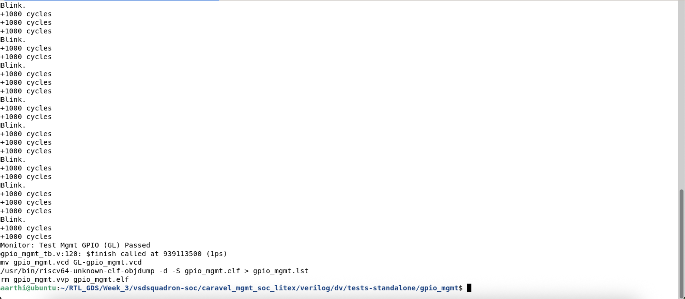
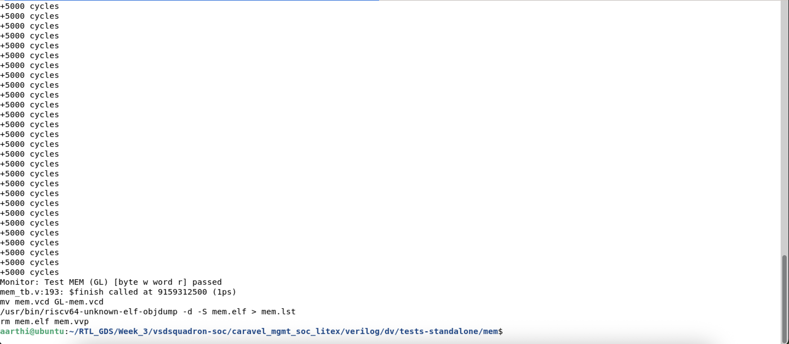
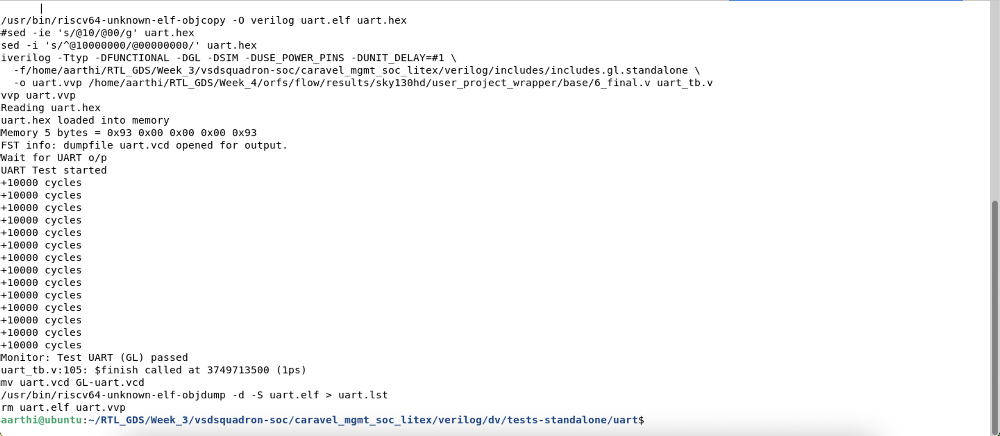
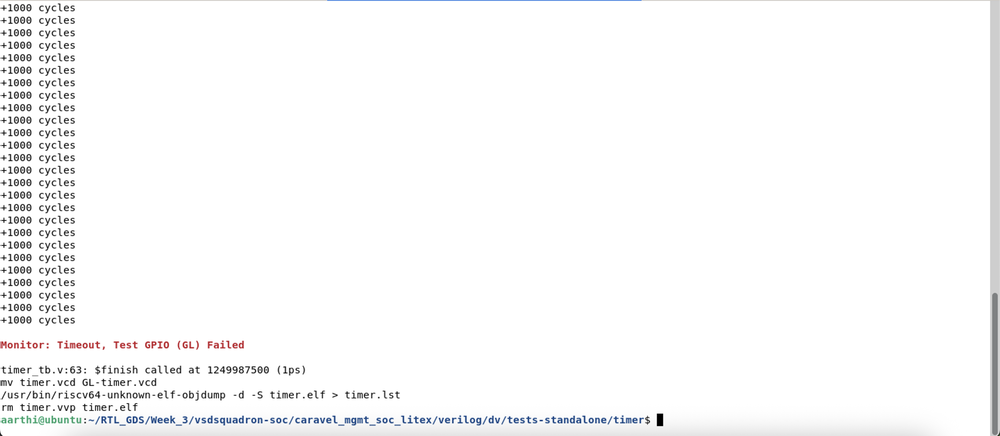
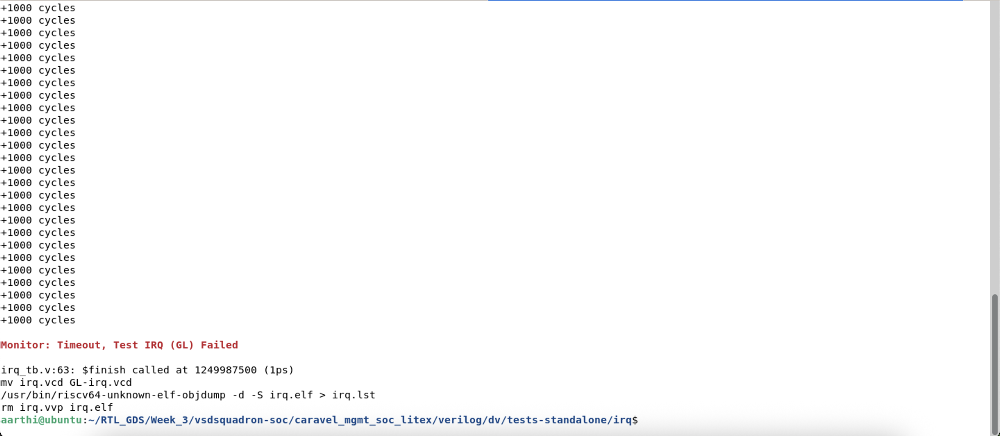
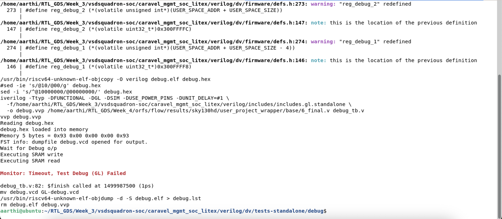
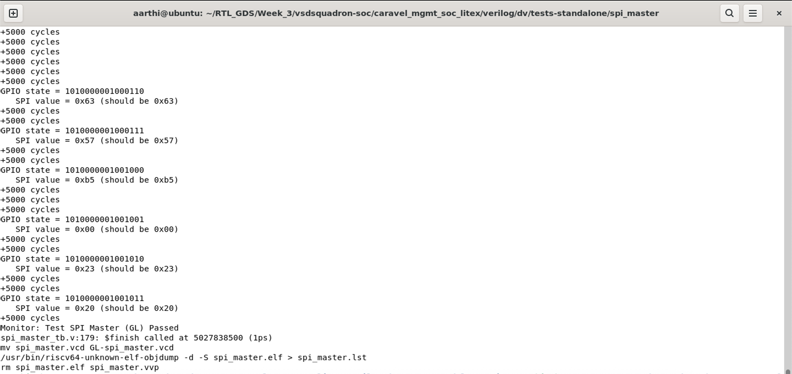

# Gate-Level Simulation (GLS) for Full Block Verification

## PHASE 3 — Run GLS for Standalone Tests

### Execution results:

#### 1️⃣ gpio_mgmt - Passed

#### 2️⃣ mem - Passed

#### 3️⃣ uart - Passed

#### 4️⃣ timer - Failed

#### 5️⃣ irq - Failed

#### 6️⃣ debug - Failed

#### 7️⃣ spi_master - Passed

### Standalone GLS Result Table 

| Test | RTL Status(Week-3)| GLS Status|
| -------- | -------- | --------|
| gpio_mgmt	| PASS	| PASS |
| mem	| PASS | PASS |
| uart	| PASS | PASS |
| timer	| FAIL | FAIL |
| irq	| FAIL | FAIL |
| debug	| FAIL | FAIL |
| spi_master	| PASS | PASS |

### Inference
GLS verification results successfully align with the previously established RTL verification outcomes.