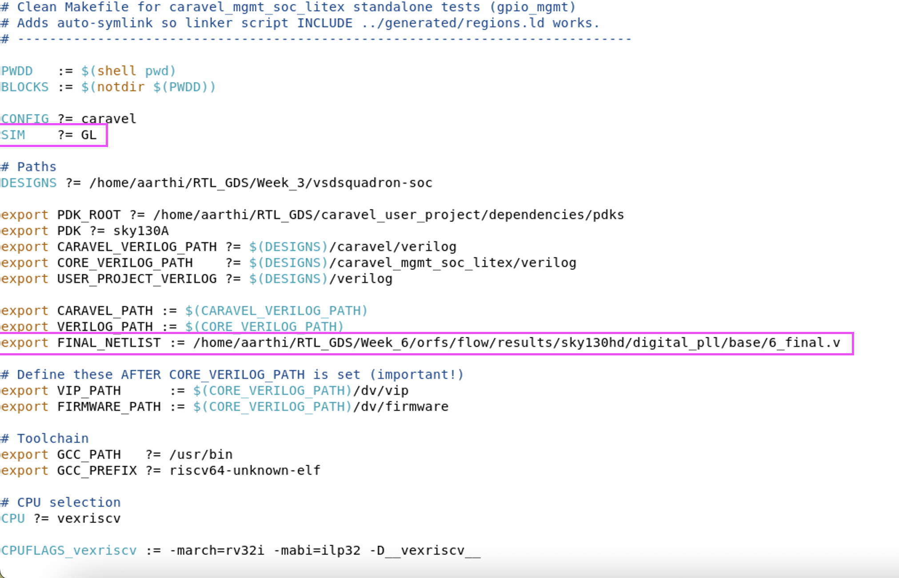
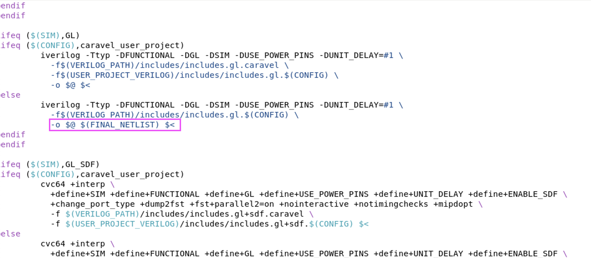
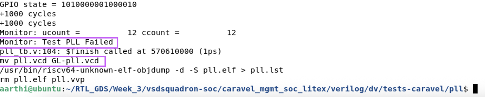
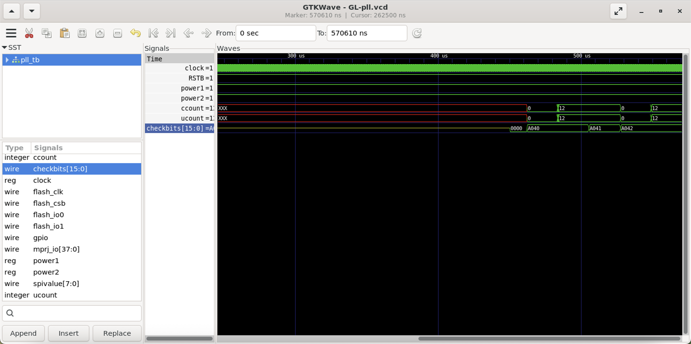
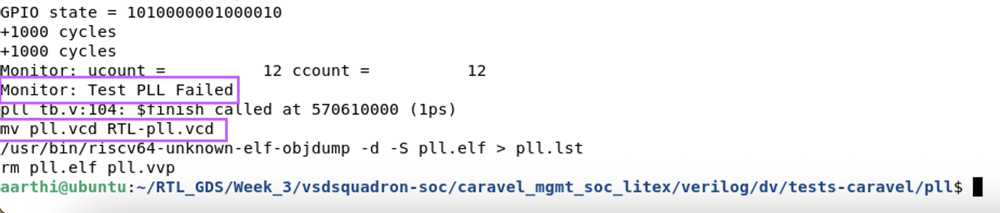

# Independent Block Implementation + Gate-Level Validation

## PHASE 1 — Block Selection and Analysis

The **"digital_pll.v"** block is selected for the implementation from "https://github.com/vsdip/vsdsquadron-soc/tree/add-vsdsquadron-soc-folders/caravel/verilog/rtl" repository

Refer to **"block_selection.md"** for comprehensive details about the selected block.

---
## PHASE 2 — RTL-to-GDS Implementation

The full OpenROAD flow includes Synthesis, Floorplanning, Placement, Clock Tree Synthesis, Routing, Fill Insertion, Final database generation and Final GDS generation stages.

Detailed information regarding the RTL to GDS Implementation can be found in **"rtl_analysis.md"** file

---
## PHASE 3 — Generate Implementation Outputs

The key outputs generated in the flow are documented in **"rtl_analysis.md"** file

---
## PHASE 4 — Gate-Level Simulation (GLS)

- The file **"6_final.v"** is the final netlist generated post simulation for the design_pll project
- The full path of the netlist is **"RTL_GDS/Week_6/orfs/flow/results/sky130hd/digital_pll/base/6_final.v"**
- It acts as the  primary input for Gate-Level Simulation (GLS)
- In order to proceed with GLS, some changes need to be made in the makefile which are listed below,
    + The simulator need to be changed from RTL to GL. This is done by changing the value of **"SIM"** as **"GL"**
    + The file path of the 6_final.v file is added to the variable named **"FINAL_NETLIST"** 
    + **"-o $@ $(FINAL_NETLIST) $<"** was added to provide the digital_pll file for GLS
- The below images depict the changes made in the makefile

### Caravel test - pll:
- The **"pll_tb.v"** is the testbench file fetched from "https://github.com/vsdip/vsdsquadron-soc/tree/add-vsdsquadron-soc-folders/caravel_mgmt_soc_litex/verilog/dv/tests-caravel/pll" for this design
- According to the pll_tb.v, the test will “Pass” only if the checkbits equals to 16'hA090, post getting the counts for both clocks which should match the expected hardware ratios exactly in all the five phases, else it will “Fail”
- The Status of the test is **"Fail" (as expected)**

---
## PHASE 5 — Waveform Validation
The below image depicts the waveform generated for the pll caravel test viewed in the **GTKWave** tool using the generated **".vcd"** file 

Main signals:
- ccount
- ucount
- checkbits

The value of checkbits changed from 0 to A040 to A041 and then to A042 where the values of ccount and ucount changes from 0 to 12 and 12 to 0

---
## PHASE 6 — RTL vs GLS Validation
The final netlist generated post final execution for "digital_pll" was verified using the **"pll_tb.v"** in the following ways:
- Assigning "SIM" as **"RTL"** in the make file 
- Assigning "SIM" as **"GL"** in the make file

#### RTL:
- The Status of the test is **"Fail" (as expected)**
- A .vcd file named **"RTL-pll.vcd"** is generated

#### GLS:
- The Status of the test is **"Fail" (as expected)**
- A .vcd file named **"GL-pll.vcd"** is generated

#### Conclusion:
No mismatch is found in functionality between the RTL and GL simulation. The test "Failed" in both the cases as expected

---
## PHASE 7 — Debugging and Insights
The issues faced while implementing the independent block are documented in **"debugging_notes.md"**

---

