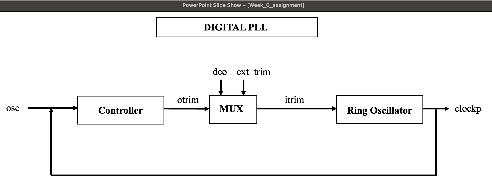
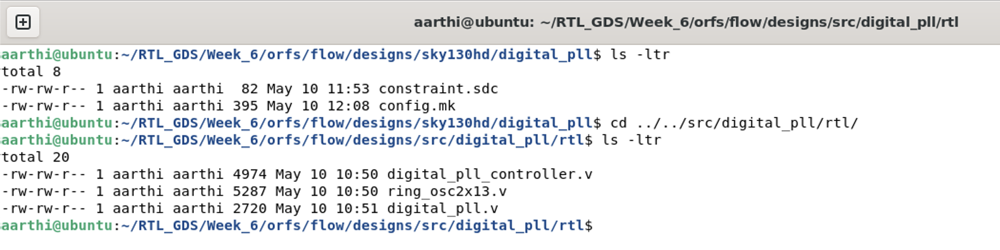

# Independent Block Implementation + Gate-Level Validation

## PHASE 1 — Block Selection and Analysis

### About digital_pll.v:
- This design defines the Digital Phase-Locked Loop
- **"Ring Oscillator"** and **"Controller"** are the two main functional blocks
- The below block diagram depicts the functionality of "PLL"

### Explanation of the module hierarchy:
  + The digital_pll is the main module used in this design
  + This module instantiates 2 other modules. The 2 modules include digital_pll_controller and ring_osc2x13
  + digital_pll_controller is instantiated as **"pll_control"** and ring_osc2x13 is instantiated as **"ringosc"**
### List of all RTL files used in the design:
  + digital_pll.v
  + digital_pll_controller.v
  + ring_osc2x13.v
  

---