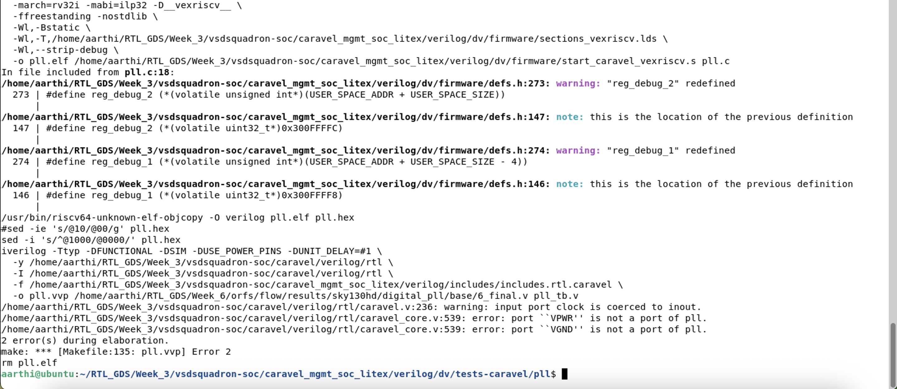
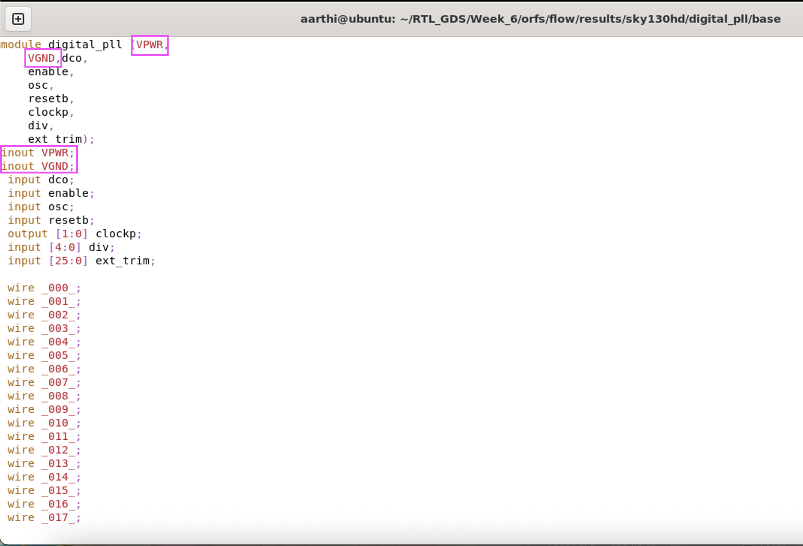
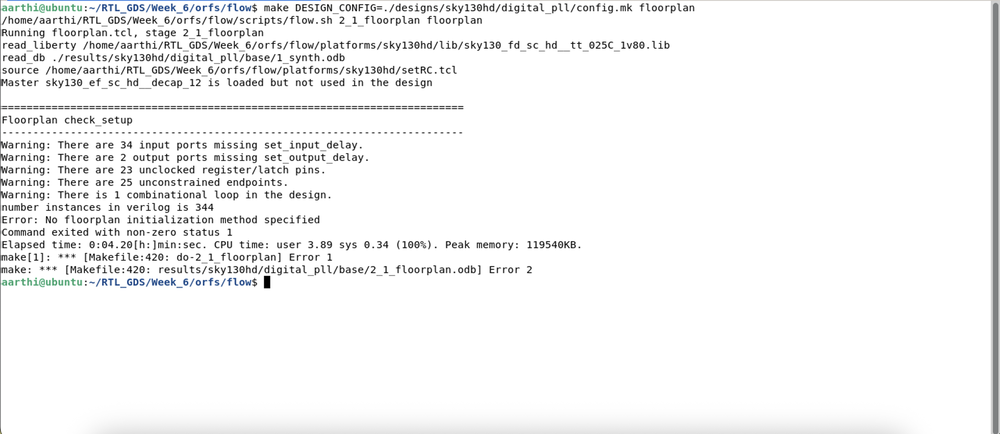
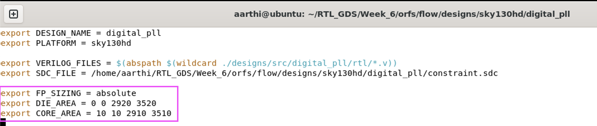

# Independent Block Implementation + Gate-Level Validation

## PHASE 7 — Debugging and Insights
**Issue 1** - port VPWR is not a part of pll and port VGND is not a part of pll

**Steps taken to overcome Issue 1:**
- "VPWR" port is added in the final netlist
- "VGND" port is added in the final netlist

**Issue 2** - No floorplan initialization method specified

**Steps taken to overcome Issue 2:**
- DIE_AREA, CORE_AREA and FP_SIZING are added in the config.mk file

---